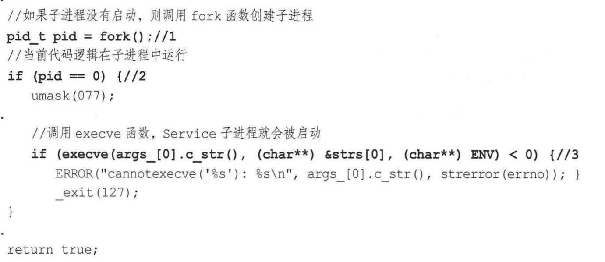

# 安卓进阶解密笔记

#### 安卓操作系统结构

* Application (Java)
* Framework (Java API framework)
* Native 
  * C/C++
  * Runtime library
    * Core library
    * ART
* HAL (硬件抽象层) 软件调用硬件接口
* Linux Kernel

#### Android系统启动

* 电源按下，ROM程序进入RAM
* Bootloader导引程序拉起OS
* Linux 内核启动寻找init.rc，执行init进程
* Init进程初始化，fork Zygote子进程

#### Android Init Language

* 解析init.rc, init.zygote64.rc
* Action, Command, Service, Option, and Import
  * Service
    * ServiceParser 解析器
      * `std::make_unique<Service>(name, str_args)` 学习make_unique 
      * ServiceManager单例加入Service链表中
    * 启动Zygote
      * `ServiceManager::GetInstance().ForEachServiceInClass(args[1], { s->StartIfNotDisabled();});` 学习lambda表达式 
      * 先判断是否已经启动
        * 如果启动了那么fork一个子Zygote进程
        * 学习execve 

#### 属性服务

* 记录之前的注册表中的记录，初始化时使用
* 网络编程
  * epoll
  * non-blocking socket
* 检查属性
  * ctl. 控制属性: 执行命令
  * 普通属性
    * ro. 只读
    * persist. 

#### Zygote

* Zygote创造DVM,ART,application process, and System Server
* 通过 args 的 --zygote, --start-system-server来区分当前进程是在zygote，还是在system-server中，因为zygote进程是通过fork自己创建子进程的，需要flag来区分
* runtime.start() C++方法来调用Java方法
  * 启动Java虚拟机
  * 为Java虚拟机注册JNI方法
  * `env->NewStringUTF(className)` C++ String to Java String
  * `toSlashClassName(className)` //将className . 替换成 /
  * `env->FindClass(slashClassName)`
  * `jmethodID startMeth = env->GetStaticMethodID(startClass, "main", "([Ljava/lang/String;])V")` 获取main方法
  * `env->CallStaticVoidMethod(startClass, startMeth, strArray);` 通过JNI调用main方法
* ZygoteInit.java
  * 创建一个Server端的Socket
  * 预加载类和资源
  * 启动SystemServer
  * 等待AMS请求

#### SystemServer

* SystemServer创建AMS, WMS, 和 PMS
* 启动Binder线程池与其他线程通信
* 加载动态库libandroid_servers.so
* 启动引导服务
* 启动核心服务
* 启动其他服务
* 

#### PackageManagerService

* 由mSystemServiceManager创建
* 注册到ServiceManager
  * 管理各种Service
  * C/S架构中Binder通信机制

#### Launcher

* 是Android系统的桌面
  * 用于启动应用程序
  * 管理应用图标和显示
* 请求PackageManagerService返回系统中已安装的application信息

### 

