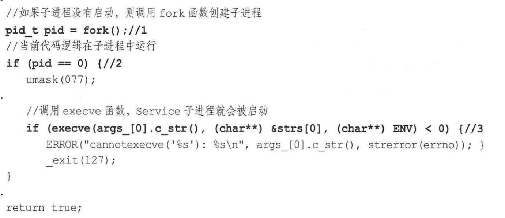

# 安卓进阶解密笔记

#### 安卓操作系统结构

* Application (Java)
* Framework (Java API framework)
* Native 
  * C/C++
  * Runtime library
    * Core library
    * ART
* HAL (硬件抽象层) 软件调用硬件接口
* Linux Kernel

#### Android系统启动

* 电源按下，ROM程序进入RAM
* Bootloader导引程序拉起OS
* Linux 内核启动寻找init.rc，执行init进程
* Init进程初始化，fork Zygote子进程

#### Android Init Language

* 解析init.rc, init.zygote64.rc
* Action, Command, Service, Option, and Import
  * Service
    * ServiceParser 解析器
      * `std::make_unique<Service>(name, str_args)` 学习make_unique 
      * ServiceManager单例加入Service链表中
    * 启动Zygote
      * `ServiceManager::GetInstance().ForEachServiceInClass(args[1], { s->StartIfNotDisabled();});` 学习lambda表达式 
      * 先判断是否已经启动
        * 如果启动了那么fork一个子Zygote进程
        * 学习execve 

#### 属性服务

* 记录之前的注册表中的记录，初始化时使用
* 网络编程
  * epoll
  * non-blocking socket
* 检查属性
  * ctl. 控制属性: 执行命令
  * 普通属性
    * ro. 只读
    * persist. 

#### Zygote

* Zygote创造DVM,ART,application process, and System Server

