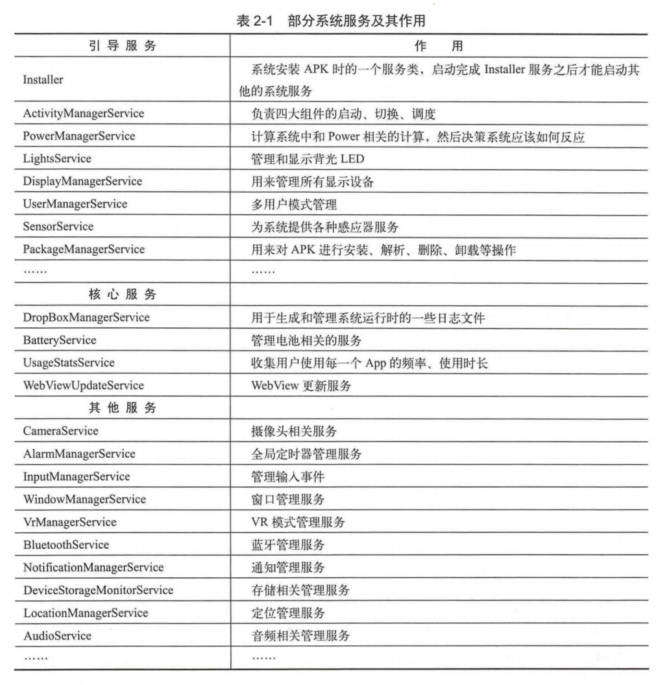

# 安卓进阶解密笔记

#### 安卓操作系统结构

* Application (Java)
* Framework (Java API framework)
* Native 
  * C/C++
  * Runtime library
    * Core library
    * ART
* HAL (硬件抽象层) 软件调用硬件接口
* Linux Kernel

#### Android系统启动

* 电源按下，ROM程序进入RAM
* Bootloader导引程序拉起OS
* Linux 内核启动寻找init.rc，执行init进程
* Init进程初始化，fork Zygote子进程
* 

#### Android Init Language

* 解析init.rc, init.zygote64.rc
* Action, Command, Service, Option, and Import
  * Service
    * ServiceParser 解析器
      * `std::make_unique<Service>(name, str_args)` <font color=red>学习make_unique</font> 
      * ServiceManager单例加入Service链表中
    * 启动Zygote
      * `ServiceManager::GetInstance().ForEachServiceInClass(args[1], [](Service * s){ s->StartIfNotDisabled();});` <font color=red>学习lambda表达式</font> 
      * 先判断是否已经启动
        * 如果启动了那么fork一个子Zygote进程
        * <font color=red>学习execve</font> 


#### 属性服务

* 记录之前的注册表中的记录，初始化时使用
* 网络编程
  * <font color=red>epoll</font>
  * non-blocking socket
* 检查属性
  * ctl. 控制属性: 执行命令
  * 普通属性
    * ro. 只读
    * persist. 

#### Zygote

* Zygote创造DVM,ART,application process, and System Server
* 通过 args 的 --zygote, --start-system-server来区分当前进程是在zygote，还是在system-server中，因为zygote进程是通过fork自己创建子进程的，需要flag来区分
* runtime.start() C++方法来调用Java方法
  * 启动Java虚拟机
  * 为Java虚拟机注册JNI方法
  * `env->NewStringUTF(className)` C++ String to Java String
  * `toSlashClassName(className)` //将className . 替换成 /
  * `env->FindClass(slashClassName)`
  * `jmethodID startMeth = env->GetStaticMethodID(startClass, "main", "([Ljava/lang/String;])V")` 获取main方法
  * `env->CallStaticVoidMethod(startClass, startMeth, strArray);` 通过JNI调用main方法
* ZygoteInit.java
  * 创建一个Server端的Socket
  * 预加载类和资源
  * 启动SystemServer
  * 等待AMS请求

#### SystemServer

* SystemServer创建AMS, WMS, 和 PMS
* 启动Binder线程池与其他线程通信
* 加载动态库libandroid_servers.so
* 启动引导服务
* 启动核心服务
* 启动其他服务
* 

#### PackageManagerService

* 由mSystemServiceManager创建
* 注册到ServiceManager
  * 管理各种Service
  * C/S架构中Binder通信机制

#### Launcher

* 是Android系统的桌面
  * 用于启动应用程序
  * 管理应用图标和显示
* 请求PackageManagerService返回系统中已安装的application信息
* 调用了AMS的startHomeActivityLocked方法
* 三种工厂模式
  * 非工厂模式
  * 低级工厂模式
  * 高级工厂模式
* 有HomeIntent来启动桌面活动
* 如何显示各应用图标
  * 每个工作区用来描述一个抽象桌面
    * 由n个屏幕组成，每个屏幕分成n个单元格，每个单元格用来显示一个应用程序的快捷图标

#### 应用程序进程启动过程

* 应用程序需要先有对应的进程
* AMS作为Client端，发送请求到Zygote的Server端Socket，来创建应用程序进程
* 连接Zygote分为主模式(zygote)和辅模式(zygote_secondary)
* ABI (Application Binary Interface)
  * 应用程序二进制接口ABI（Application Binary Interface）定义了二进制文件（尤其是.so文件）如何运行在相应的系统平台上，从使用的指令集，内存对齐到可用的系统函数库。
* ActivityThread
* Binder线程池
  * `ZygoteInit.nativeZygoteInit()`
  * `ProcessState->startThreadPool()`
  * `spawnPooledThread()`
  * IPCThreadState的joinThreadPool将当前线程注册到Binder驱动程序中,新创建的线程就加入了Binder线程池中，新创建的应用就支持Binder进程间通信

#### 消息循环创建

* ActivityThread类用于管理当前应用进程的主线程
* `Looper.prepareMainLooper()`
* `sMainThreadHandler = thread.getHandler()`
* `Looper.loop()`

#### 四大组件的工作过程

#### 根Activity的启动过程

* Root Activity是第一个被启动的活动

* 调用startActivity

* 调用Instrumentation的execStartActivity

  * Instrumentation用来监控应用程序和系统的交互

* ActivityManager.getService()

* 调用IActivityManagerSingleton的get方法

  * ```java
    private static final Singleton<IActivityManager> IActivityManagerSingleton = new Singleton<IActivityManager>(){
        @Override
        protected IActivityManager create(){
            final IBinder  b = ServiceManager.getService(Context.ACTIVITY_SERVICE);
            final IActivityManager am = IActivityManager.Stub.asInterface(b);
            return am;
        }
    }
    ```

  * 以上是AIDL生成的

  * IActivityManager.Stub类实现进程间通信

* AMS到ApplicationThread

  * 

* 

#### Service的启动过程

* ContextImpl到ActivityManageService
  * Activity.attach将Activity和上下文appContext关联起来
* ActivityThread启动Service
  * ServiceLookupResult
  * ServiceRecord (可以从PackageManagerService获取)
  * 找到ServiceRecord对应的ProcessRecord
    * 如果进程不存在
      * 调用AMS的startProcessLocked方法创建对应的应用进程
  * ApplicationThread是ActivityThread的内部类
  * Service被封装成ActivityClientRecord
  * sendMessage方法向H类发送为CREATE_SERVICE的消息
  * mH指向H类，是ActivityThread的内部类并继承自Handler，是应用进程中主线程的消息管理类
  * 获取要启动Service的应用程序的LoadedAPK
  * Service.attach来初始化
  * 调用service的onCreate方法

#### Service的绑定过程

* ContextImpl到AMS的绑定过程
  * IServiceConnection实现Binder机制，这样Service绑定就支持跨进程
    * 具体实现为ServiceDispatcher.InnerConnection，其中ServiceDispatcher是LoadedApk的内部类
  * bindService
* Service的绑定过程

#### 广播的注册、发送和接受过程

* 广播的注册
  * 静态注册 (由PackageManagerService来注册完成)
  * 动态注册 (registerReceiver方法)
    * ContextWrapper中实现
    * ContextImpl中registerReceiverInternal
    * 获取IIntentReceiver对象
    * 注册广播是一个跨进程过程
    * 粘性广播 (sendStickyBroadcast)
      * Intent会一直保留到广播事件结束，而这种广播也没有所谓的10秒限制，10秒限制是指普通的广播如果onReceive方法执行时间太长，超过10秒的时候系统会将这个广播置为可以干掉的candidate，一旦系统资源不够的时候，就会干掉这个广播而让它不执行
* 广播的发送
  * ContextImpl到AMS
    * 调用AMS的broadcastIntent方法
      1. 验证广播是否合法
      2. 将动态注册的广播接收者和静态注册的广播接受者按照优先级高低不同存储在不同的列表中
      3. 调用broadcastQueue
  * AMS到BroadReceiver
    * BroadcastHandler对象发送BROADCAST_INTENT_MSG类型消息
    * 在BroadcastHandler的handleMessage方法中处理
    * 进入processNextBroadcast方法
    * 遍历无序广播发送给Receivers
    * 判断广播接受者所在进程是否存在，即ApplicationThread
    * 通过IIntentReceiver实现跨进程通信(AIDL)，具体实现为LoadedApk.ReceiverDispatcher.InnerReceiver继承自IIntentReceiver.Stub是Binder通信的服务端，而IIntentReceiver则是Binder通信的客户端
    * LoadedApk.ReceiverDispatcher执行具体逻辑
    * mActivityThread.post(args.getRunnable())
    * 将Args对象的getRunnable方法通过H类发送到线程的消息队列中

#### ContentProvider的启动过程

* query到AMS
  * getContentResolver()
  * ContextImpl.getContentResolver()返回ApplicationContentResolver
  * acquireUnstableProvider(Uri uri)
  * mMainThread.acquireProvider()即ActivityThread获取Provider
  * 有一个mProviderMap用来缓存ContentProvider，不需要每次都调用AMS的getContentProvider方法
  * 获取ContentProvider的应用进程信息（ProcessRecord）
  * 判断进程是否已经启动，如果没有就创建
  * 如果没有启动
    * ActivityThread的main里的Looper.loop()会开始消息循环
    * 调用AMS的attachApplication方法
* AMS启动ContentProvider
  * AMS的attachApplication
  * thread的bindApplication向H发送BIND_APPLICATION类型信息
  * ActivityThread的handleBindApplication
  * 创建ContextImpl，反射创建Instrucmentation，创建application，调用onCreate方法，在启动之前启动ContentProvider
  * AMS的publishConentProvider方法将ContentProvider存储在AMS的mProviderMap中
  * 反射创建localProvider,调用ContentProvider的onCreate抽象方法

#### 上下文对象Context


* ContextWrapper使用了装饰模式
* ContextThemeWrapper中包含不同的主题，那么Activity就继承他。反之，Service不需要主题
* 组合而非继承的方式

#### Application Context的创建过程

* ActivityThread类的内部类ApplicationThread的scheduleLaunchActivity方法启动Activity
* ApplicationThread的scheduleLaunchActivity方法向H类发送消息，目的是启动Activity在主线程中
* H类的handleMessage通过getPackageInfoNoCheck获得LoadedApk对象
* ActivityThread的performLaunchActivity
* LoadedApk.makeApplication
* ContextImpl的createAppContext方法创建ContextImpl
* mActivityThread.mInstrumentation.newApplication传入contextImpl
* ContextImpl.setOuterContext(app)
* app.attach(context)
* 将ContextImpl赋值给ContextWrapper的mBase

#### Application Context的获取过程

* ContextWrapper的getApplicationContext()
* 如果LoadedApk的mPackageInfo不为null，则调用LoadedApk的getApplication方法
* 返回mApplication

#### Activity的Context创建过程

* ActivityThread的createBaseContextForActivity(ActivityClientRecord)返回ContextImpl
* 传入ContextImpl到activity通过attach方法
* ContextImpl.createActivityContext返回ContextImpl
* attach方法中调用attachBaseContext(ContextThemeWrapper)
* 调用父类(ContextWrapper)的attachBaseContext

#### Service的Context创建过程

* ActivityThread启动Service
  * ActivityThread的内部类ApplicationThread的scheduleCreateService
  * 其中sendMessage方法向H类发送CREATE_SERVICE消息
  * H类handleMessage调用ActivityThread的handleCreateService
  * ContextImpl.createAppContext返回ContextImpl
  * service.attach(context)
  * attachBaseContext(context)

#### 理解AMS

* Android7.0 AMS
  * ActivityManager通过ActivityManagerNative的getDefault方法获取ActivityManagerProxy，通过AMP和AMS通信
  * Instrumentation的execStartActivity调用ActivityManagerNative的getDefault获取AMP
    * getDefault是一个singleton类
    * 获取IBinder类型的AMS引用
    * 将其封装成AMP类型对象 (asInterface(IBinder)) -> new ActivityManagerProxy(IBinder)
  * 通过IBinder类型对象mRemote向服务端AMS发送一个START_ACTIVITY_TRANSACTION类型的进程间通信请求，服务端会从Binder线程池中读取客户端发来的数据，最终会调用AMN的onTransact方法
  * onTransact调用AMS的startActivity方法
* AMP是Client端，AMN是Server端
* AMS是AMN的子类，AMP是AMS的Client端代理，AMN又实现了Binder类，这样AMP和AMS就可以实现Binder间通信了

* 

* 

#### Android8.0的AMS

* 和7.0的区别在于采用了AIDL (IActivityManager是AIDL工具在编译时自动生成)
* 服务端只需要让AMS继承IActivityManager.Stub并实现方法
* 

#### AMS的启动过程

* SystemServer中startBootstrapServices方法启动引导服务
* mSystemServiceManager.startServer(ActivityManagerService.Lifecycle.class)
* service.onStart就是启动了AMS

#### AMS与应用进程

* AMS检查应用程序所在进程是否存在，如果不存在就请求Zygote进程创建所需的应用进程

#### AMS重要的数据结构

* ActivityRecord
  * 

* TaskRecord
  * 

* ActivityStack

  * ActivityStackSupervisor管理ActivityStack

  * ActivityState

    * ```java
      enum ActivityState{
          INITIALIZATING,
          RESUMED,
          PAUSING,
          PAUSED,
          STOPPING,
          STOPPED,
          FINISHING,
          DESTROYING,
          DESTROYED
      }
      ```

    * 当ActivityState为RESUMED或者PAUSING时才会调用WMS的方法来切换动画

#### Activity任务栈管理


* LaunchFlags类似launch mode，只不过在源码中
* taskAffinity设置在AndroidManifest.xml，用来指定Activity希望归属的栈

#### 理解WindowManager

* Window, WindowManager, 和 WMS

* Window是一个抽象类（具体实现为PhoneWindow）, WindowManage是一个接口继承自ViewManager，WindowManager的实现类为WindowManagerImpl

* 

  * WindowManager除了拥有ViewManager增删改的方法，还添加了

    * ```java
      public Display getDefaultDisplay(); //将Window添加到哪个屏幕上
      public void removeViewImmediate(); //完成传入View的相关销毁工作
      ```

  * PhoneWindow在Activity的attach中创建

  * WindowMangerImpl在addView方法中使用了[桥接模式](https://www.runoob.com/w3cnote/bridge-pattern2.html)，将功能[委托](https://www.runoob.com/w3cnote/delegate-mode.html)给了WindowManagerGlobal

  * 

* Window的类型

  * Application Window （应用程序窗口）
    * Type从1-99
  * Sub Window  (子窗口)
    * Type从1000-1999
  * System Window (系统窗口)
    * Type从2000-2999
  * 窗口显示次序
    * 从屏幕里到屏幕外作为z轴
    * Type越大越靠近用户（排前面）

* Window的标志

  * 

  * ```java
    Window mWindow = getWindow();
    mWindow.addFlags(WindowManager.LayoutParams.FLAG_FULLSCREEN);
    ```

  * ```java
    Window mWindow = getWindow();
    mWindow.setFlags(WindowManager.LayoutParams.FLAG_FULLSCREEN, WindowManager.LayoutParams.FLAG_FULLSCREEN);
    ```

* 系统窗口的添加过程
  * StatusBar是系统的状态栏（显示时间，电量，信号）
  * 构造StatusBar视图并且添加到StatusBarManagerWindowManager
  * mWindowManager.addView(mStatusBarView) 添加到WMS中，调用的其实是ViewManager的addView方法
  * mGlobal.addView
  * ViewRootImpl
    * View树的根并管理View树
    * 触发View树的测量
    * 管理Surface
    * 负责与WMS进行进程间通信
  * IWindowSession是一个Binder类型，是Client的代理; Server端实现为Session
  * 
  * WMS为添加的窗口分配Surface，并确定窗口的显示次序，Surface就是画布，而SurfaceFlinger是一个混合器
* Window的更新过程
  * ViewManager的updateViewLayout，在WindowManagerImpl中实现
  * 调用WindowManagerGlobal的updateViewLayout方法
  * ViewRootImpl的scheduleTraversals
  * performTraversals()
    * relayout (重新构造结构)
    * measure (重新测量)
    * draw (重新绘制)

#### 理解WindowManagerService

* 职责
  * 窗口管理
  * 窗口动画 (WindowAnimator)
  * 输入系统的中转站（触摸事件）（InputManagerService）
  * Surface管理 （绘制）
  * 

* WMS的创建过程
  * SystemServer的main方法
  * WMS属于其他服务的一种（引导服务i.e.AMS，核心服务i.e.BatteryService,，其他服务i.e.WMS）
  * startOtherService中
    * watchdog用来监视系统的一些关机服务
    * WMS是在SystemServer的线程中的
    * 调用WMS的main方法
  * DisplayThread.getHandler().runWithScissors()是一个单例的前台线程，这个线程用来处理需要低延时显示的相关操作
    * 判断了当前线程是否是Handler所指向的线程
      * 如果是
        * 执行Runnable的run方法
      * 如果不是
        * 执行BlockingRunnable的postAndWait方法
        * 让system_server线程等待android.display线程
  * 创建了一个WindowManagerService的单例
  * 构造方法中
    * 持有IMS的引用
    * AMS的引用
    * 创建WindowAnimator
    * WindowManagerPolicy定义一个窗口策略所要遵守的通用规范
    * 将WMS加入到Watchdog中（Watchdog每分钟都会对被监控的系统服务进行检查，如果服务出现死锁，则会杀死Watchdog所在进程）
  * 

* WMS的重要成员
  * mPolicy: WindowManagerPolicy
    * 允许定制窗口层级和特殊窗口类型以及关键调度和布局
  * mSession: ArraySet
    * 进程间通信
    * 其他应用进程通信和WMS必须经过Session，每个进程对应一个session
  * mWindowMap: WindowHashMap
    * 继承自HashMap
    * 限制了HashMap的key为IBinder类型
  * mFinishedStarting: ArrayList
    * WindowToken的子类
      * 窗口令牌（应用程序申请窗口的通行证）
  * mResizingWindows: ArrayList
    * WindowState
    * 用来存储正在调整大小的窗口
  * mAnimator: WindowAnimator
    * 管理窗口动画和特效动画
  * mH: H
    * 系统的Handler类，用于将任务加入到主线程的消息队列中
  * mInputManager: InputManagerService
    * 输入系统的管理者

* Window的添加过程
  * WMS的addWindow方法
    * WMP的checkAddPermission方法来检查权限
    * 通过displayId来获得窗口要添加到哪个DisplayContent上（DisplayContent用来描述一块屏幕）
    * type代表一个窗口类型位于1000-1999（是子窗口）
    * windowForClientLocked方法会根据attrs.token作为key从mWindowMap中获得该子窗口的父窗口
  * 创建WindowState
  * IWindow会将WMS中窗口管理的操作回调给ViewRootImpl
  * 判断添加窗口的客户端是否已经死亡

* Window的删除过程
  * WindowManagerImpl的removeView
  * ViewRootImpl的die方法
  * immediate为立即执行
  * WindowManagerGlobal的doRemoveView
    * 从ViewRootImpl列表，布局参数列表和View列表中删除View元素
  * ViewRootImpl的doDie中dispatchDetachedFromWindow
  * mWindowSession.remove(mWindow);
  * WMS的removeWindow
  * removeIfPossible（不会直接执行删除操作，进行多个条件过滤）
  * removeImmediately()
  * 清除session对应的surfaceSession
  * WMS的postWindowRemoveCleanupLocked进行对View的清理

#### JNI原理

