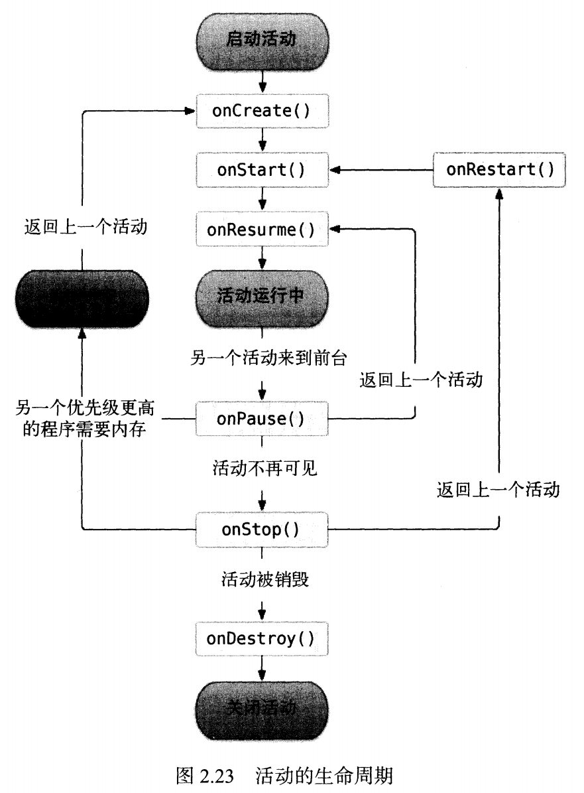
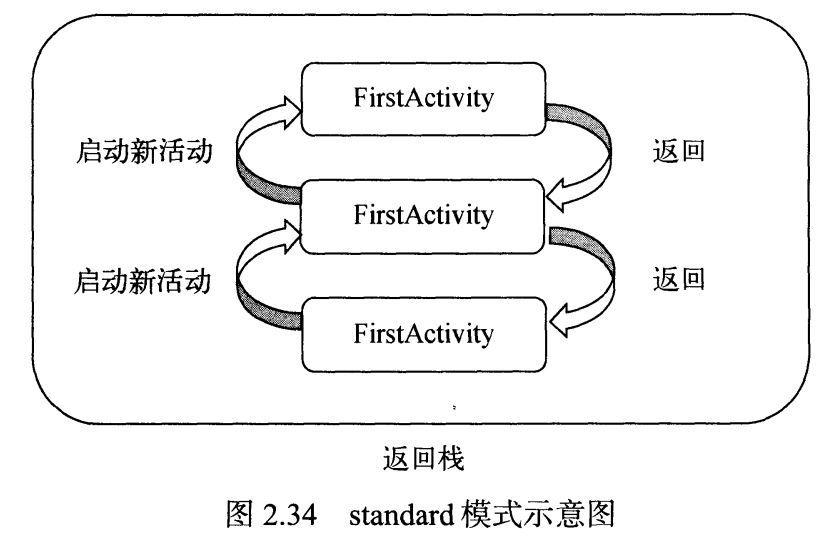
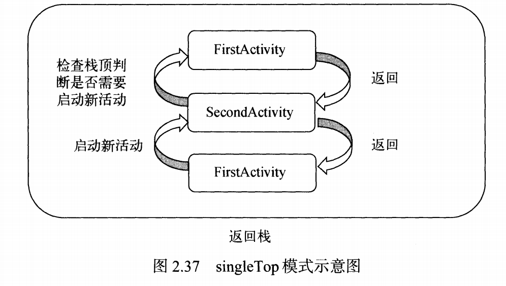
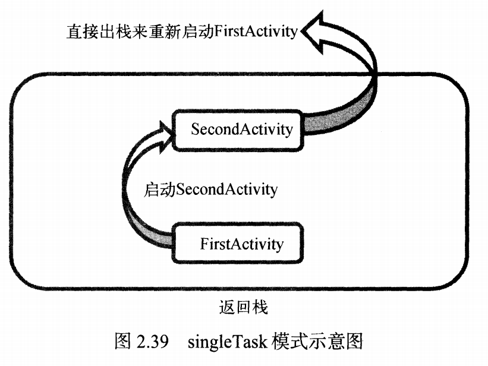
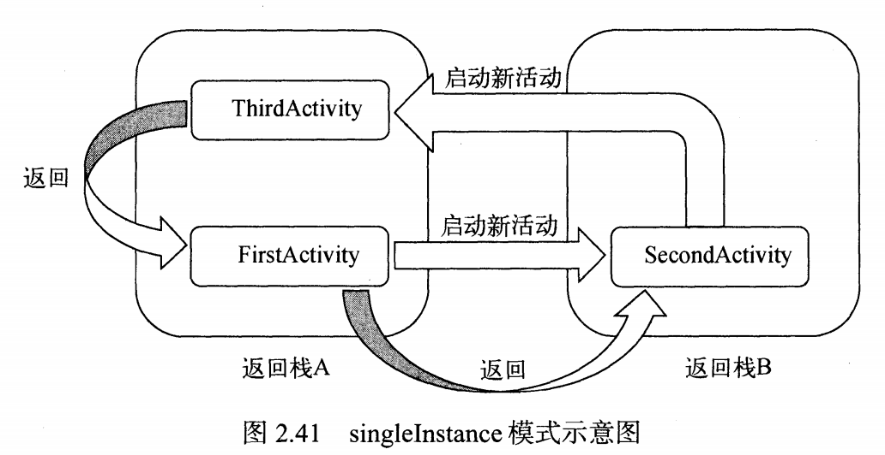
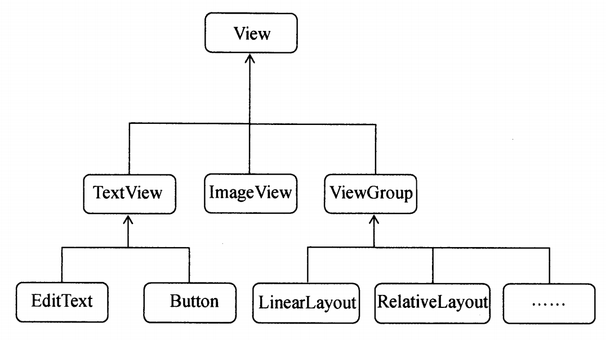
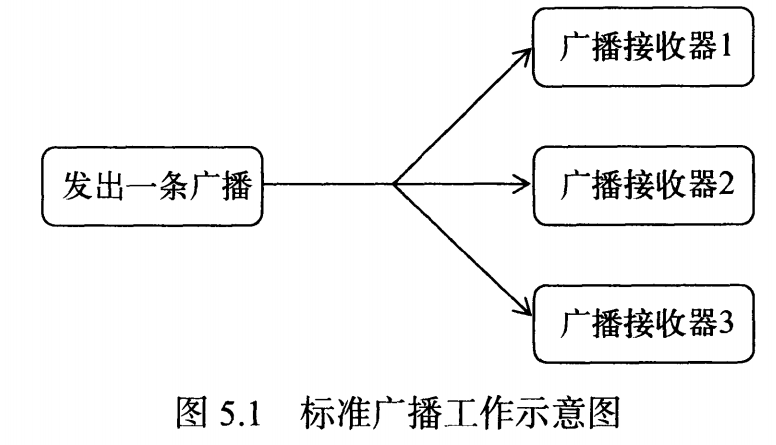
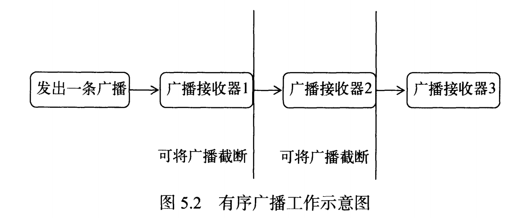
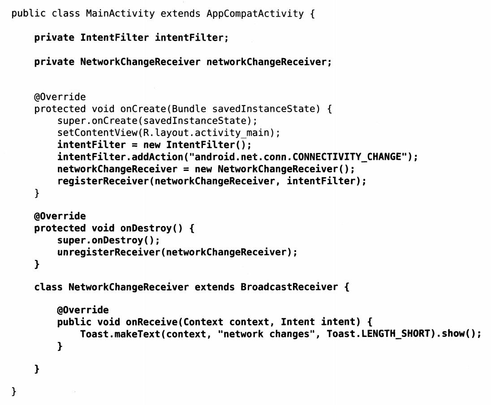
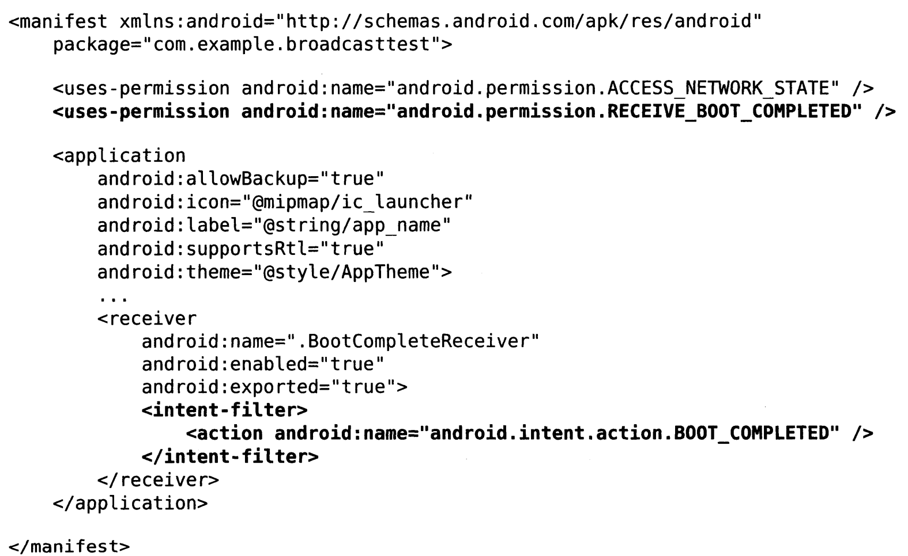

# 第一行代码笔记

### 项目目录

* proguard-rules.pro
  * 指定项目代码混淆规则，防止其他人破解
* AppCompatActivity
  * 向下兼容到Android2.1系统
* build.gradle
  * jcenter:	代码托管仓库
  * dependencies:	
    * 本地依赖: compile fileTree(dir: 'lib', include: ['*.jar'])
    * 库依赖: compile project(':helper')
    * 远程依赖: compile 'com.android.support:appcompat-v7 : 24.2.1'

### 日志工具Log

* Log.v    verbose 
* Log.d   debug
* Log.i    info
* Log.w  warn
* Log.e   error
* 以上过滤程度从低到高: verbose可以看到所有日志，error只能看到error日志
* 在Android Studio中，还可以Edit Filter Configuration去自定义日志过滤器

### 菜单Menu

* 右上角三个点，点击后可以弹出一个下拉列表
* 在res目录下新建menu文件夹, 再新建menu.xml文件
* `<menu xmlns:android="http://schemas.android.com/apk/res/android">`
* `<item android:id="@+id/add_item android:title="Add"/>`
* `<item android:id="@+id/remove_item android:title="Remove"/>`
* `</menu>`
* 重写onCreateOptionsMenu
* `getMenuInflater().inflate(R.menu.menu,menu); return true;` 获取这个menu并显示
* 重写onOptionsItemSelected(MenuItem item)
* 通过item.getItemId()判断是哪一个item被选择了

### 销毁活动

* finish()

### Intent

* 显式

  * 作用：调用自己程序内的活动
  * Intent(当前活动对象，目标活动Class)
    *  `Intent it = new Intent(FirstActivity.this, SecondActivity.class)`
    * `startActivity(it);`
  * 总结：纯java代码实现跳转

* 隐式

  * 作用: 调用其他程序的活动

    * 实现打开一个浏览器

      * ```java 
        Intent intent = new Intent(Intent.ACTION_VIEW);
        intent.setData(Uri.parse("http://www.baidu.com"));
        startActivity(intent);
        ```

    * 实现打电话

      * ```java 
        Intent intent = new Intent(Intent.ACTION_DIAL);
        intent.setData(Uri.parse("tel:10086"));
        startActivity(intent);
        ```

  * ```xml 
    <activity android:name=".SecondActivity">
    	<intent-filter>
        	<action android:name="com.example.activitytest.ACTION_START"/>
            <category android:name="android.intent.category.DEFAULT"/>
        </intent-filter>
    </activity>
    ```

  * ```java 
    Intent intent = new Intent("com.example.activitytest.ACTION_START");
    ```

  * 通过 action的 android:name属性值找到匹配的活动页，进行跳转

  * 总结：XML和Java代码结合

* 传递数据给下一个活动

  * 发送发

    * ```java 
      intent.putExtra("extra_data",data);
      ```

  * 接收方

    * ```java
      Intent intent = getIntent();
      String data = intent.getStringExtra("extra_data");
      ```

* 传递数据给上一个活动

  * 主活动

    * ```java 
      startActivityForResult(intent,1); //第二个参数是唯一的代码
      
      //重写onActivityResult来接收来自次活动的数据
      protected void onActivityResult(int requestCode, int resultCode, Intent data){
          switch(requestCode){
              case 1:
                  if(resultCode == RESULT_OK){
                      String returnedData = data.getStringExtra("data_return");
                  }
                  break;
              default;
          }
      }
      ```

  * 次活动

    * ```java 
      Intent intent = new Intent();
      intent.putExtra("data_return","Hello FirstActivity");
      setResult(RESULT_OK,intent);
      finish();
      ```

### 活动的生命周期

* 符合栈的数据结构
* Back或者finish()用来去除栈顶活动
* 四种状态
  1. 运行状态
     1. 活动位于栈顶
  2. 暂停状态
     1. 活动不在栈顶，但是仍然可见
  3. 停止状态
     1. 活动不在栈顶，也不可见
  4. 销毁状态
     1. 活动从栈中移除

### 活动的生存期

* onCreate 活动第一次创建

* onStart 活动由不可见变成可见

* onResume 活动准备好和用户交互时调用

* onPause 启动或者恢复另一个活动

* onStop 活动变成不可见

* onDestroy 活动销毁之前

* onRestart 停止变成运行状态之前

* 

* 活动回收后数据保存问题：

  * onSaveInstanceState(Bundle outState) 方法中可以保存临时数据

  * ```java 
    @Override
    protected void onCreate(Bundle savedInstanceState){
        super.onCreate(savedInstanceState);
        setContentView(R.layout.activity_main);
        if(savedInstanceState != null){
            String tempData = savedInstanceState.getString("data_key");
        }
    }
    ```

  * onCreate方法中Bundle参数可以判断是否存入临时数据

### 活动的启动模式

* `<activity launchMode=''/>`

* standard
  * 每次创建新的实例
  * 
* singleTop
  * 栈顶活动不会重复创建实例（本质是对standard的优化）
  * 
* singleTask
  * 所有栈中的活动都只有一个实例
  * 
* singleInstance
  * 指定的Activity会被单独放在另一个栈中
  * 

### 杀掉进程

`android.os.Process.killProcess(android.os.Process.myPid());`

### 活动启动的最佳写法

添加一个static函数，将需要的参数传入，名字就叫actionStart，一目了然

### TextView

* `android:gravity="center"` 居中对齐
  * `android:gravity="center_vertical | center_horizontal"` 多个值共同作用

### Button

* `android:textAllCaps="false"` 关闭大小写自动转换

### EditText

* `android:maxLine="2"` 最多为两行
* `android:hint="Type something here"` 提示

### Visibility

* `android:visibility="visible"`
* `android:visibility="invisible"` 不可见并占据原来的位子和大小
* `android:visibility="gone"` 不可见并不占据原来的位子和大小

### LinearLayout

* `android:layout_gravity` 当排列方向是horizontal时，只有垂直方向上的对齐方式才会生效
* `android:gravity`是对于文字产生对齐效果
* `android:layout_weight`使用比例指定控件的大小
  * 两个控件width="0dp"并且layout_weight="1"意味着他们平分空间

### FrameLayout

* 默认空间都放在屏幕左上角

### PercentFrameLayout

* `app:layout_widthPercent="50%"`
* `app:layout_heightPercent="50%"`
* 百分比帧布局
* 在`com.android.support:percent:24.2.1`

### 自定义控件

* 
* 所有的控件继承自View
* 所有的布局继承自ViewGroup

### ListView

* 展示用法


* ConvertView和ViewHolder可以优化ListView

  * ConvertView用来缓存Inflater每次创建控件的开销

    * ```java 
      View view;
      if(convertView == null){
          view = LayoutInflater.from(getContext()).inflate(resourceId, parent, false);
      }else{
          view = convertView;
      }
      ```

  * ViewHolder用来节约findViewById的开销

    * 创建一个内部类ViewHolder包含每个Item的属性

      * ```java 
        class ViewHolder{
            ImageView fruitImage;
            TextView fruitName;
        }
        ```

      * ```java
        ViewHolder viewHolder;
        if(convertView == null){
            view = LayoutInflater.from(getContext()).inflate(resourceId,parent,false);
            viewHolder = new ViewHolder;
            viewHolder.fruitImage = (ImageView) view.findViewById(R.id.fruit_image);
            viewHolder.fruitName = (TextView) view.findViewById(R.id.fruit_name);
            view.setTag(viewHolder); //将ViewHolder存储在View中
        }else{
            view = convertView;
            viewHolder = (ViewHolder) view.getTag(); //重新获取ViewHolder
        }
        viewHolder.fruitImage.setImageResource(fruit.getImageId());
        viewHolder.fruitName.setText(fruit.getName());
        ```

### RecyclerView

* 比ListView性能高，并且兼备水平和垂直布局
* `com.android.support.recyclerview-v7:24.2.1`
* 
* RecyclerView通过LayoutManager接口实现不同的布局
* GridLayoutManager实现网格
* StaggeredGridLayoutManager实现瀑布流
  * `StaggeredGridLayoutManager layoutManager = new StaggeredGridLayoutManager(3,StaggeredGridLayoutManager.VERTICAL);`	
  * 以上代码定义了一个为3列的，并且纵向排列的瀑布流布局

### Nine-Patch

* 特殊处理过的png，可以指定哪些区域被拉伸，哪些区域不可以

### 碎片

* UI代码片段

* 平板开发中使用

* 粒度上比活动更小

  * 可以实现手机端上两个活动
  * 平板上一个两个碎片在一个活动上

* ```java 
  public class LeftFragment extends Fragment {
      @Override
      public View onCreateView(LayoutInflater inflater, ViewGroup container, Bundle savedInstanceState){
          View view = inflater.inflate(R.layout.left_fragment, container, false);
          return view;
      }
  }
  ```

* ```xml 
  <fragment android:id="@+id/left_fragment"
            android:name="com.example.fragmenttest.LeftFragment"
            android:layout_width="0dp"
            android:layout_height="match_parent"
            android:layout_weight="1"/>
  ```

* 动态替换碎片

  * ```java 
    private void replaceFragment(Fragment fragment){
        FragmentManager fragmentManager = getSupportFragmentManager();
        FragmentTransaction transaction = fragmentManager.beginTransaction();
        transaction.replace(R.id.right_layout, fragment);
        transaction.commit();
    }
    ```

  * ```java
    private void replaceFragment(Fragment fragment){
        FragmentManager fragmentManager = getSupportFragmentManager();
        FragmentTransaction transaction = fragmentManager.beginTransaction();
        transaction.replace(R.id.right_layout, fragment);
        transaction.addToBackStack(null); //实现类似活动的返回栈效果
        transaction.commit();
    }
    ```

* 碎片和活动之间通信

  * 活动中调用碎片

    * ```java
      RightFragment rightFragment = (RightFragment) getFragmentManager().findFragmentById(R.id.right_fragment);
      ```

  * 碎片调用活动

    * ```java
      MainActivity activity = (MainActivity) getActivity();
      ```

* 碎片的生命周期
  * 运行状态
    * 碎片可见，并且活动运行
  * 暂停状态
    * 活动暂停，碎片也暂停
  * 停止状态
    * 活动停止，碎片也停止
  * 销毁状态
    * 活动销毁，碎片销毁
  * 

### 动态加载布局

* 可以实现不同屏幕大小设备的布局文件动态切换

* 使用限定符（在res下创建文件夹名为layout-xxx）
  * 大小
    * layout-large 提供给大屏幕设备的资源
    * layout-small 提供给小屏幕设备的资源
    * layout-normal 
    * layout-xlarge
  * 分辨率
    * ldpi 	<120dpi
    * mdpi   120dpi-160dpi
    * hdpi     160-240dpi
    * xhdpi    240-320dpi
    * xxhdpi  320dpi-480dpi
  * 方向
    * land 横屏设备
    * port 竖屏设备
* 最小宽度限定符
  * layout-sw600p 屏幕宽度大于>600dp就加载对应的布局

### 广播机制

* 类型
  * 标准广播 
    * 
  * 有序广播
    * 

* 广播注册

  * 动态注册

    * 代码完成

    * 

      * ```xml
        <uses-permission android:name="android.permission.ACCESS_NETWORK_STATE"></uses-permission> <!--网络权限申请-->
        ```

  * 静态注册

    * AndroidManifest.xml中声明
    * 

* 发送广播

  * 发送标准广播

    * ```xml
      <application>
      	<receiver
               android:name=".MyBroadcastReceiver"
               android:enabled="true"
               android:exported="true">
              <intent-filter>
                  <action android:name="com.example.broadcasttest.MY_BROADCAST" />
              </intent-filter>
          </receiver>
      </application>
      ```

    * ```java
      Intent intent = new Intent("com.example.broadcasttest.MY_BROADCAST");
      sendBroadcast(intent);
      ```

  * 发送有序广播

    * ```java
      sendOrderedBroadcast(intent,null);
      ```

    * ```xml
      <application>
      	<receiver
               android:name=".MyBroadcastReceiver"
               android:enabled="true"
               android:exported="true">
              <intent-filter android:priority="100"> <!--当前Receiver的优先级为100-->
                  <action android:name="com.example.broadcasttest.MY_BROADCAST" />
              </intent-filter>
          </receiver>
      </application>
      ```

    * ```java
      abortBroadcast(); //可以阻止发送消息到之后的receivers
      ```

* 本地广播

  * 更加安全，防止广播信息到其他应用

  * ```java
    localBroadcastManager = LocalBroadcastManager.getInstance(this);//获取实例
    ```

  * 其他代码和<font color="red">动态注册广播</font>一样

### 数据持久化

* 文件存储

  * Context类提供openFileOutput方法

  * 写入

    * ```java
      FileOutputStream out = openFileOutput("data",Context.MODE_PRIVATE);
      BufferedWriter writer = new BufferedWriter(new OutputStreamWriter(out));
      writer.write(data);
      writer.close();
      ```

  * 读取

    * ```java
      FileInputStream in = openFileInput("data");
      BufferedReader reader = new BufferedReader(new InputStreamWriter(in));
      StringBuilder content = new StringBuilder();
      String line = "";
      while((line = reader.readLine())!=null){
          content.append(line);
      }
      reader.close();
      ```

  * 默认存储在/data/data/<packagename>/files

  * 两种Mode

    * MODE_PRIVATE 覆盖文件内容
    * MODE_APPEND 文件内容追加

* SharedPreference

  * 存储在/data/data/<packagename>/shared_prefs/

  * 写入

    * ```java
      SharedPreference.Editor editor = getSharedPreferences("data",MODE_PRIVATE).edit();
      editor.putString("name","Tom");
      editor.putInt("age",28);
      editor.putBoolean("married",false);
      editor.apply();
      ```

  * 读取

    * ```java
      SharedPreference pref = getSharedPreferences("data",MODE_PRIVATE);
      String name = pref.getString("name","");
      int age = pref.getInt("age",0);
      boolean married = pref.getBoolean("married",false);
      ```

* 数据库存储

  * SQLite

    * 建表

      * ```sqlite
        create table Book (
        	id integer primary key autoincrement,
            author text,
            price real,
            pages integer,
            name text
        )
        ```

    * ```java
      public class MyDatabaseHelper extends SQLiteOpenHelper{
          public static final String CREATE_BOOK = "SQL";
          private Context mContext;
          
          public MyDatabaseHelper(Context context, String name, SQLiteDatabase.CursorFactory factory, int version){
              super(context, name, factory, version);
              mContext = context;
          }
          
          @Override
          public void onCreate(SQLiteDatabase db){
              db.execSQL(CREATE_BOOK);
          }
      }
      ```

    * adb shell调试工具

      * 可以直接对连接在电脑上的手机或者模拟器进行调试操作

* SD卡

* CRUD

  * 插入

    * ```java
      SQLiteDatabase db = dbHelper.getWritableDatabase();
      ContentValues values = new ContentValues();
      values.put("name","The Da Vinci Code");
      values.put("price",16.96);
      values.put("author","Dan Brown");
      values.put("pages",454);
      db.insert("Book",null,values); //插入数据
      ```

    * ```java
      db.execSQL("insert into Book (name,author,pages,price) values (?, ?, ?, ?)", new String[]{"The Da Vinci Code", "Dan Brown", "454", "16.96"});
      ```

  * 更新

    * ```java
      SQLiteDatabase db = dbHelper.getWritableDatabase();
      ContentValues values = new ContentValues();
      values.put("price",10.99);
      db.update("Book", values, "name = ?", new String[] {"The Da Vinci Code"});
      ```

    * ```java
      db.execSQL("update Book set price = ? where name = ?", new String[]{"16.96","The Da Vinci Code"});
      ```

  * 删除

    * ```java
      SQLiteDatabase db = dbHelper.getWritableDatabase();
      db.delete("Book", "pages > ?", new String[] {"500"});
      ```

    * ```java
      db.execSQL("delete from Book where pages > ?", new String[]{"500"});
      ```

  * 查询

    * | query()方法参数 |        对应SQL部分        |            描述             |
      | :-------------: | :-----------------------: | :-------------------------: |
      |      table      |      from table_name      |                             |
      |     columns     |  select column1, column2  |                             |
      |    selection    |   where column = value    |                             |
      |  selectionArgs  |             -             | 为where的占位符提供具体的值 |
      |     groupBy     |      group by column      |                             |
      |     having      |   having column = value   |                             |
      |     orderBy     | order by column1, column2 |                             |

    * 查询一个表的所有数据

      * ```java
        SQLiteDatabase db = dbHelper.getWritableDatabase();
        Cursor cursor = db.query("Book",null,null,null,null,null,null);
        if(cursor.moveToFirst()){
            do{
                //遍历Cursor对象
                String name = cursor.getString(cursor.getColumnIndex("name"));
                String author = cursor.getString(cursor.getColumnIndex("author"));
                int pages = cursor.getInt(cursor.getColumnIndex("pages"));
                double price = cursor.getDouble(cursor.getColumnIndex("price"));
            }while(cursor.moveToNext());
        }
        cursor.close();
        ```

      * ```java
        db.rawQuery("select * from Book",null);
        ```

* LitePal

  * ORM框架

  * 配置

    * ```
      dependencies{
          compile 'org.litepal.android.core:1.3.2'
      }
      ```

    * 创建app/src/main/assets/litepal.xml

      * ```xml
        <?xml version="1.0" encoding="utf-8"?>
        <litepal>
        	<dbname value="BookStore"></dbname>
            <version value="1"></version>
            <list></list>
        </litepal>
        ```

    * 修改AndroidManifest.xml

      * ```xml
        <application android:name="org.litepal.LitePalApplication"></application>
        ```

  * 使用

    * ```xml
      <?xml version="1.0" encoding="utf-8"?>
      <litepal>
      	<dbname value="BookStore"></dbname>
          <version value="1"></version>
          <list>
          	<mapping class="com.example.litepaltest.Book"></mapping>
          </list>
      </litepal>
      ```

    * 创建一个 Book对象

    * ```java
      Connector.getDatabase() //直接创建数据库
      ```

    * 当修改字段，比如添加一个字段，或者增加一个实体，只需要在litepal.xml中给version+1

    * 插入

      * ```java
        public class Book extends DataSupport {
        ```

      * ```java
        Book book = new Book();
        book.setName("The Da Vinci Code");
        book.setAuthor("Dan Brown");
        book.save();
        ```

    * 更新

      * ```java
        Book book = new Book();
        book.setName("The Da Vinci Code");
        book.setAuthor("Dan Brown");
        book.save();
        book.setPrice(14.95);
        book.save();
        ```

      * ```java
        Book book = new Book();
        book.setPrice(14.95);
        book.setToDefault("pages");//更新为默认值
        book.updateAll("name = ? and author = ?", "The Lost Symbol", "Dan Brown");
        ```

    * 删除

      * ```java
        DataSupport.deleteAll(Book.class,"price < ?","15");
        ```

    * 查询

      * ```java
        List<Book> books = DataSupport.findAll(Book.class); //查询所有数据
        ```

      * ```java
        List<Book> books = DataSupport.findFirst(Book.class); //查询第一条数据
        ```

      * ```java
        List<Book> books = DataSupport.findLast(Book.class); //查询最后一条数据
        ```

      * ```java
        List<Book> books = DataSupport.select("name","author").find(Book.class); //projection
        ```

      * ```java
        List<Book> books = DataSupport.where("pages > ?","400").find(Book.class); //过滤
        ```

      * ```java
        List<Book> books = DataSupport.order("price desc").find(Book.class); //排序
        ```

      * ```java
        List<Book> books = DataSupport.limit(3).find(Book.class); //查询表中前3条数据
        ```

      * ```java
        List<Book> books = DataSupport.limit(3).offset(1).find(Book.class); //查询表中第2,3,4条数据
        ```

      * ```java
        List<Book> books = DataSupport.select("name","author","pages").where("pages > ?","400").limit(10).order("pages").offset(10).find(Book.class);
        ```

      * 原生查询

        * ```java
          Cursor c = DataSupport.findBySQL("select * from where pages > ? and price < ?","400","20");
          ```

### 跨程序共享数据

* ContentProvider
  * 不同的应用之间实现数据共享
  * 更加安全
  * 权限系统
    * 运行时权限 (安装程序后再决定是否给予某一个功能是权限
    * 普通权限
    * 危险权限
      * 

* ContentResolver

  * 读取数据表

    * ```java
      Uri uri = Uri.parse("content://com.example.app.provider/table1"); //寻找对应应用的数据库表
      Cursor cursor = getContentResolver().query(uri,projection,selection,selectionArgs,sortOrder); //查询
      ```

    * ```java
      ContentValues values = new ContentValues();
      values.put("column1","text");
      values.put("column2",1);
      getContentResolver().insert(uri,values); //插入
      ```

    * ```java
      ContentValues values = new ContentValues();
      values.put("column1","");
      getContentResolver().update(uri,values,"column1 = ? and column2 = ?", new String[]{"text","1"}); //更新
      ```

    * ```java
      getContentResolver().delete("column2 = ? ", new String[]{"1"}); //删除* 
      ```

  * 读取联系人

    * ```java
      cursor = getContentResolver().query(ContactsContract.CommonDataKinds.Phone.CONTENT_URI, null, null, null, null);
      if(cursor != null){
          while(cursor.moveToNext()){
              //联系人名字
              String displayName = cursor.getString(cursor.getColumnIndex(ContactsContract.CommonDataKinds.Phone.DISPLAY_NAME));
              //电话
              String number = cursor.getString(cursor.getColumnIndex(ContactsContract.CommonDataKinds.Phone.NUMBER));
          }
      }
      ```

    * ```xml
      <uses-permission android:name="android.permission.READ_CONTACTS"/>
      ```

* 创建内容提示器

  * ```java
    public class MyProvider extends ContentProvider{
        @Override
        public boolean onCreate(){
            return false; //数据库升级和创建
        }
        
        @Override
        public Cursor query(Uri uri, String[] projection, String selection, String[] selectionArgs, String sortOrder){
            return null;
        }
        
        @Override
        public Uri insert(Uri uri, ContentValues values){
            return null;
        }
        
        @Override
        public int update(Uri uri, ContentValues values, String selection, String[] selectionArgs){
            return 0;
        }
        
        @Override
        public int delete(Uri uri, ContentValues values, String[] selectionArgs){
            return 0;
        }
        
        @Override
        public String getType(Uri uri){
            return null; //根据传进来的uri返回对应的MIMI类型
        }
    }
    ```

  * ```
    content://com.example.app.provider/table1 获取table1所有的数据
    content://com.example.app.provider/* 匹配任意长度的字符
    ```

  * ```
    content://com.example.app.provider/table1/1 获取table1,id为1的数据
    content://com.example.app.provider/table1/# 匹配任意长度的数字
    ```

  * ```java
    public class MyProvider extends ContentProvider{
    	public static final int TABLE1_DIR = 0;
        
        public static final int TABLE1_ITEM = 1;
        
       	public static final int TABLE2_DIR = 2;
        
        public static final int TABLE2_ITEM = 3;
        
        private static UriMatcher uriMatcher;
        
        static{
            uriMatcher = new UriMatcher(UriMatcher.NO_MATCH);
            uriMatcher.addURI("com.example.app.provider","table1",TABLE1_DIR);
            uriMatcher.addURI("com.example.app.provider","table1/#",TABLE1_ITEM);
            uriMatcher.addURI("com.example.app.provider","table2",TABLE2_DIR);
            uriMatcher.addURI("com.example.app.provider","table2/#",TABLE2_ITEM);
        }
        
        @Override
        public Cursor query(Uri uri, String[] projection, String selection, String[] selectionArgs, String sortOrder){
            switch (uriMatcher.match(uri)){
                case TABLE1_DIR:
                    //查询table1表中的所有数据
                    break;
                case TABLE1_ITEM:
                    //查询table1表中的单条数据
                    break;
                case TABLE2_DIR:
                    //查询table2表中的所有数据
                    break;
                case TABLE2_ITEM:
                    //查询table2表中的单条数据
                    break;
                default:
                    break;
    
            }
            return null;
        }
        
        @Override
        public String getType(Uri uri){
            switch (uriMatcher.match(uri)){
                case TABLE1_DIR:
                    return "vnd.android.cursor.dir/vnd.com.example.app.provider.table1";
                case TABLE1_ITEM:
                    return "vnd.android.cursor.item/vnd.com.example.app.provider.table1";
                case TABLE2_DIR:
                    return "vnd.android.cursor.dir/vnd.com.example.app.provider.table2";
                case TABLE2_ITEM:
                    return "vnd.android.cursor.item/vnd.com.example.app.provider.table2";
                default:
                    break;
            }
            return null;
        }
    }
    ```

  * ```xml
    <application>
        <provider 
                  android:name=".DatabaseProvider"
                  android:authorities="com.example.databasetest.provider"
                  android:enabled="true"
                  android:exported="true">
        </provider>
    </application>
    ```


### 运行手机多媒体

* Notification通知

  * ```java
    NotificationManager manager = (NotificationManager) getSystemService(Context.NOTIFICATION_SERVICE);
    
    //support v4库 兼容版
    Notification notification = new NotificationCompat.Builder(context).setContentTitle("This is content title").setContentText("This is content text").setWhen(System.currentTimeMills()).setSmallIcon(R.drawable.small_icon).setLargeIcon(BitmapFactory.decodeResource(getResource(),R.drawable.large_icon)).build();
    
    //第一个参数是id
    manager.notify(1, notification);
    ```

  * PendingIntent

    * 延迟执行Intent

    * ```java
      //构造PendingIntent
      Intent intent = new Intent(this, NotificationActivity.class);
      PendingIntent pi = PendingIntent.getActivity(this, 0, intent, 0);
      
      NotificationManager manager = (NotificationManager) getSystemService(Context.NOTIFICATION_SERVICE);
      
      //support v4库 兼容版
      Notification notification = new NotificationCompat.Builder(context).setContentTitle("This is content title").setContentText("This is content text").setWhen(System.currentTimeMills()).setSmallIcon(R.drawable.small_icon).setLargeIcon(BitmapFactory.decodeResource(getResource(),R.drawable.large_icon)).setContentIntent(pi).build();
      
      //第一个参数是id
      manager.notify(1, notification);
      ```

    * 点击通知后，让通知消失

      * ```java
        .setAutoCancel(true)
        ```

    * 通知收到时，音频提醒

      * ```java
        .setSound(Uri.fromFile(new File("/system/media/audio/ringtones/Luna.ogg")))
        ```

    * 通知收到时，震动

      * ```java
        .setVibrate(new long[]{0, 1000, 1000, 1000})
        //手机静止时长，手机震动时长，手机静止时长
        //收到消息手机立刻震动一秒，然后一秒，然后又震动一秒
        ```

      * ```xml
        <uses-permission android:name="android.permission.VIBRATE"/>
        ```

    * LED灯闪

      * ```java
        .setLights(Color.GREEN, 1000, 1000) //灯亮起时长，灯暗去的时长
        ```

    * 自动判断根据环境播放什么铃声

      * ```java
        .setDefaults(NotificationCompat.DEFAULT_ALL);
        ```

* 高级功能

  * ```java
    .setStyle(new NotificationCompat.BigTextStyle().bigText("......................")).build(); //显示长文字
    ```

  * ```java
    .setStyle(new NotificationCompat.BigPictureStyle().bigPicture(BitmapFactory.decodeResource(getResources(),R.drawable.big_image))).build(); //显示一张图片
    ```

  * ```java
    .setPriority(NotificationCompat.PRIORITY_MAX).build(); // 设置优先级最高
    ```

  * 调用摄像头和相册

    * ```java
      public static final int TAKE_PHOTO = 1;
      private ImageView picture;
      private Uri imageUri;
      
      File outputImage = new File(getExternalCacheDir(),"output_image.jpg");
      try{
          if(outputImage.exists()){
              outputImage.delete();
          }
          outputImage.createNewFile();
      }catch(IOException e){
          e.printStackTrace();
      }
      if(Build.VERSION.SDK_INT >= 24){
          imageUri = FileProvider.getUriForFile(MainActivity.this, "com.example.cameraalbumtest.fileprovider",outputImage);
      }else{
          imageUri = Uri.fromFile(outputImage);
      }
      //启动相机
      Intent intent = new Intent("android.media.action.IMAGE_CAPTURE");
      intent.putExtra(MediaStore.EXTRA_OUTPUT, imageUri);
      startActivityForResult(intent, TAKE_PHOTO);
      
      @Override
      protected void onActivityResult(int requestCode, int resultCode, Intent data){
          switch(){
              case TAKE_PHOTO:
                  if(resultCode == RESULT_OK){
                      try{
                          Bitmap bitmap = BitmapFactory.decodeStream(getContentResolver().openInputStream(imageUri));
                          picture.setImageBitmap(bitmap);
                      }catch(FileNotFoundException e){
                          e.printStackTrace();
                      }
                  }
              default:
                  break;
          }
      }
      ```

    * ```xml
      <uses-permission android:name="android.permission.WRITE_EXTERNAL_STORAGE"/>
      
      <application>
      	<provider
                    android:name="android.support.v4.content.FileProvider"
               android:authorities="com.example.cameraalbumtest.fileprovider"
                    android:exported="false"
                    android:grantUriPermissions="true">
              <meta-data 
                         android:name="android.support.FILE_PROVIDER_PATHS"
                         android:resource="@xml/file_paths"/>
          </provider>
      </application>
      ```

    * 选择相册图片上传

      * 详情见书
      * 打开相册的Intent("android.intent.action.GET_CONTENT")
      * 运行时权限申请
      * 处理图片的方式分为4.4以上和以下版本
        * 以上
          * 如果图片Uri为document类型
          * 如果图片Uri为content类型
          * 如果图片Uri为file类型
          * 解析对应的imagePath
          * 显示图片
        * 以下
          * 通过Uri和selection来获取真是的图片路径

* 播放多媒体文件
  * 播放音频
    * MediaPlayer
  * 播放视频
    * VideoView

### 网络技术

* WebView

  * 打开一个网页

  * ```xml
    <WebView 
             android:id="@+id/web_view"
             android:layout_width="match_parent"
             android:layout_height="match_parent"/>
    ```

  * ```java
    WebView webview = (WebView) findViewById(R.id.web_view);
    webview.getSettings().setJavaScriptEnabled(true);
    webview.setWebViewClient(new WebViewClient());
    webView.loadUrl("http://www.baidu.com");
    ```

  * ```xml
    <uses-permission android:name="android.permission.INTERNET"/>
    ```

* 使用HTTP协议访问网络

  * HttpURLConnection

  * OkHttp

    * ```
      dependencies{
      	compile 'com.squareup.okhttp3:okhttp:3.4.1'
      }
      ```

    * ```java
      //GET
      OkHttpClient client = new OkHttpClient();
      Request request = new Request.Builder().url("http://www.baidu.com").build();
      Response response = client.newCall(request).execute();
      String responseData = response.body().string();
      ```

    * ```java
      //POST
      OkHttpClient client = new OkHttpClient();
      //增加提交表单键值对
      RequestBody requestBody = new FormBody.Builder().add("username","admin").add("password","123456").build();
      Request request = new Request.Builder().url("http://www.baidu.com").post(requestBody).build();
      Response response = client.newCall(request).execute();
      String responseData = response.body().string();
      ```
      
    * 回调
    
      * ```java
        client.newCall(request).enqueue(callback);
        ```
    
      * ```java
        HttpUtil.sendOkHttpRequest("http://www.baidu.com",new okhttp3.Callback(){
           @Override
            public void onResponse(Call call, Response response) throws IOException{
                
            }
            
            @Override
            public void onFailure(Call call, IOException e){
                
            }
        });
        ```
    
      * 

* 解析XML数据

  * Pull解析
  * SAX解析

* 解析JSON数据

  * JSONObject

  * GSON

    * ```java
      Gson gson = new Gson();
      Person person = gson.fromJson(jsonData, Person.class);
      ```

    * ```java
      Gson gson = new Gson();
      List<Person> person = gson.fromJson(jsonData, new TypeToken<List<Person>>(){}.getType());
      ```

### 服务Service

* Android多线程

  * 继承Thread
  * 实现Runnable

* 异步消息处理机制

  * ```java
    public class MainActivity extends AppCompatActivity implements View.OnClickListner{
        
        public static final int UPDATE_TEXT = 1;
        
        private TextView text;
        
        private Handler handler = new Handler(){
            
            public void handleMessage(Message msg){
                switch(msg.what){
                    case UPDATE_TEXT:
                        text.setText("Nice to meet you");
                    default:
                        break;
                }
            }
        }
        
        @Override
        public void onClick(View v){
            switch(v.getId()){
                case R.id.change_text:
                    new Thread(new Runnable(){
                        @Override
                        public void run(){
                            Message message = new Message();
                            message.what = UPDATE_TEXT;
                            handler.sendMessage(message);
                        }
                    }).start();
            }
        }
    }
    ```

  * Message

    * 线程间传递的消息

  * Handler

    * 用于发送和处理消息

  * MessageQueue

    * 存放通过Handler发送的消息
    * 每个线程只有一个MessageQueue

  * Looper

    * MessageQueue的管家
    * 每存在一条消息就取出发给Handler

  * 使用AsyncTask

    * ```java
      //第一个参数：Void 代表不需要传入参数给doInBackground方法
      //第二参数:Integer 用来显示进度
      //第三个参数: Boolean 用来反馈结果
      class DownloadTask extends AsyncTask<Void, Integer, Boolean>{
          //异步任务开始前准备工作
          @Override
          protected void onPreExecute(){
              progressDialog.show();
          }
          
          //异步任务主要逻辑
          @Override
          protected Boolean doInBackground(Void... params){
              try{
                  while(true){
                      int downloadPercent = doDownload(); //这是一个虚构的方法
                      publishProgress(downloadPercent);
                      if(downloadPercent >= 100){
                          break;
                      }
                  }
              }catch(Exception e){
                  return false;
              }
              return true;
          }
          
          @Override
          protected void onProgressUpdate(Integer... values){
              //这里更新下载进度
              progressDialog.setMessage("Downloaded " + values[0] + "%");
          }
          
          //异步任务结束后调用
          @Override
          protected void onPostExecute(Boolean result){
              progressDialog.dismiss();
              if(result){
                  
              }else{
                  
              }
          }
      }
      ```

* Service的基本使用

  * ```java
    public class MyService extends Service{
        public MyService(){
            
        }
        
        @Override
        public IBinder onBind(Intent intent){
            
        }
        
        //服务创建时调用
        @Override
        public void onCreate(){
            super.onCreate();
        }
        
        //每次服务启动时调用
        @Override
        public int onStartCommand(Intent intent, int flags, int startId){
            return super.onStartCommand(intent,flag,startId);
        }
        
        @Override
        public void onDestroy(){
            super.onDestroy();
        }
    }
    ```

  * ```xml
    <application>
    	<service
                 android:name=".MyService"
                 android:enabled="true"
                 android:exported="true">
        </service>
    </application>
    ```

  * 启动Service

    * ```java
      Intent startIntent = new Intent(this, MyService.class);
      startService(startIntent);
      ```

  * 关闭Service

    * ```java
      Intent stopIntent = new Intent(this, MyService.class);
      stopService(stopIntent);
      ```

* 活动和服务进行通信

  * ```java
    public class MyService extends Service{
        
        private DownloadBinder mBinder = new DownloadBinder();
        
        class DownloadBinder extends Binder{
            public void startDownload(){
                Log.d("MyService","	startDownload executed");
            }
            public int getProgress(){
                Log.d("MyService","getProgress executed");
                return 0;
            }
        }
        
        @Override
        public IBinder onBind(Intent intent){
            return mBinder;
        }
    }
    ```

  * ```java
    public class MainActivity extends AppCompatActivity implements View.OnClickListner{
        private MyService.DownloadBinder downloadBinder;
        
        private ServiceConnection connection = new ServiceConnection(){
            
            @Override
            public void onServiceDisconnected(ComponentName name){
                
            }
            
            //活动与服务成功绑定
            @Override
            public void onServiceConnected(ComponentName name, IBinder service){
                downloadBinder = (MyService.DownloadBinder) service;
                downloadBinder.startDownload();
                downloadBinder.getProgress();
            }
           
        }
        
        @Override void onClick(View v){
            switch(v.getId()){
                case R.id.bind_service:
                    Intent bindIntent = new Intent(this, MyService.class);
                    //绑定服务
                    bindService(bindIntent, connection, BIND_AUTO_CREATE);
                    break;
                case R.id.unbind_service:
                    //解绑服务
                    unbindService(connection);
                    break;
            }
        }
    }
    ```

  * 服务的生命周期

* 前台服务 (类似一个应用一直显示进度)

  * ```java
    public class MyService extends Service{
        @Override
        public void onCreate(){
            Intent intent = new Intent(this,MainActivity.class);
            PendingIntent pi = PendingIntent.getActivity(this, 0, intent, 0);
            Notification notification = new NotificationCompat.Builder(this)
                .setContentTitle("This is content title")
                .setContentText("This is content text").
                .setWhen(System.currentTimeMillis())
                .setSmallIcon(R.mipmap.ic_launcher)
             .setLargeIcon(BitmapFactory.decodeResource(getResources(),R.mipmap.ic_launcher))
                .setContentIntent(pi)
                .build();
            
            //开启前台服务
            startForeground(1, notification);
        }
    }
    ```

* IntentService

  * 作用：

    * 解决主线程处理耗时的操作会产生ANR的问题（因为<font color="red">服务中的代码运行在主线程</font>）
    * 如果将每个操作放到子线程中处理虽然会解决ANR问题，但是这种服务一旦启动就处于运行状态，必须调用stopService()或者stopSelf()。所以，IntentService简化了这些复杂的写法，<font color="red">实现了自动开启子线程并且处理完后关闭子线程的能力</font>。

  * 用法:

    * ````java
      public class MyIntentService extends IntentService{
          public MyIntentService(){
              super("MyIntentService");
          }
          
          //这个方法运行在子线程
          @Override
          protected void onHandleIntent(Intent intent){
              //打印当前的线程Id
              Log.d("MyIntentService","Thread id is: " + Thread.currentThread().getId());
          }
          
          //服务调用结束关闭
          @Override
          public void onDestroy(){
              super.onDestroy();
              Log.d("MyIntentService", "onDestroy executed");
          }    
      }
      ````

    * ```java
      Intent intentService = new Intent(this, MyIntentService.class);
      startService(intentService);
      ```

    * ```xml
      <application>
      	<service android:name=".MyIntentService">
          </service>
      </application>
      ```
  

* 文件下载实践
  * 详情见第一行代码书籍

### Android位置服务

* 位置定位两种方式
  * GPS定位
    * 手机内置GPS硬件直接和卫星交互获取经纬度
    * 精度高
    * 只能户外使用
  * 网络定位
    * 根据手机附近的3个基站进行测速，进行三角定位
    * 精度一般
    * 室内外都可使用

### Material Design

* Toolbar

  * 继承了ActionBar

  * ```xml
    <FrameLayout xmlns:android="http://schemas.android.com/apk/res/android"
                 <!--命名空间切换从android到app-->
                 xmlns:app="http://schemas.android.com/apk/res-auto"
                 android:layout_width="match_parent"
                 android:layout_height="match_parent">
    			
        		<android.support.v7.widget.Toolbar
                         android.id="@+id/toolbar"
                         android:layout_width="match_parent"
                         android:layout_height="?attr/actionBarSize"
                         android:background="?attr/colorPrimary"
                         android:theme="@style/ThemeOverlay.AppCompat.Dark.ActionBar"
                         <!--为了兼容Android5.0之前的系统-->
                         app:popupTheme="@style/ThemeOverlay.AppCompat.Light"/>
    </FrameLayout>
    ```

  * ```java
    @Override
    protected void onCreate(Bundle savedInstance){
        super.onCreate(savedInstance);
        setContentView(R.layout.activity_main);
        Toolbar toolbar = (Toolbar) findViewById(R.id.toolbar);
        setSupportActionBar(toolbar);
    }
    ```

* 滑动菜单

  * DrawerLayout

  * ```xml
    <android.support.v4.widget.DrawerLayout
     xmlns:android="http://schemas.android.com/apk/res/android"                        xmlns:app="http://schemas.android.com/apk/res-auto"
     android:id="@+id/drawer_layout"
     android:layout_width="match_parent"
     android:layout_height="match_parent">
        
        <FrameLayout
                    android:layout_width="match_parent"
                     android:layout_height="match_parent">
        			<android.support.v7.widget.Toolbar
                         android.id="@+id/toolbar"
                         android:layout_width="match_parent"
                         android:layout_height="?attr/actionBarSize"
                         android:background="?attr/colorPrimary"
                         android:theme="@style/ThemeOverlay.AppCompat.Dark.ActionBar"
                         app:popupTheme="@style/ThemeOverlay.AppCompat.Light"/>
        </FrameLayout>
        
        <TextView 
                  android:layout_width="match_parent"
                  android:layout_height="match_parent"
                  android:layout_gravity="start"
                  android:text="This is menu"
                  android:textSize="30sp"
                  android:background="#FFF"/>
        
    </android.support.v4.widget.DrawerLayout>
    ```

  * ```java
    mDrawerLayout = (DrawerLayout) findViewById(R.id.drawer_layout);
    mDrawerLayout.openDrawer(GravityCompat.START);
    ```

* 导航栏NavigationView

* 悬浮按钮FloatingActionButton

* Snackbar (不同于Toast，增加了一个undo操作)

* CoordinatorLayout
  * FrameLayout的增强版
  * 可以监听其他的子控件的各种事件
* 卡片式布局 CardView
  * 将FrameLayout的边角变成圆角和阴影，显得更加立体
* 下拉刷新SwipeRefreshLayout
* 可折叠式标题 CollapsingToolbarLayout

### 进阶

* 全局获取Context

  * 问题：

    * 在HTTPUtil类中，如果我们想实现发送失败的Toast提示，那么我们需要一个Context

  * 解决办法：

    * 自定义一个Application

      * ```java
        public class MyApplication extends Application{
            
            private static Context context;
            
            @Override
            public void onCreate(){
                context = getApplicationContext();
            }
            
            //自己定义获取Context的方法
            public static Context getContext(){
                return context;
            }
        }
        ```

      * ```xml
        <!--修改AndroidManifest.xml-->
        <!--指定为自己定义的Application-->
        <application
                     android:name="com.example.networktest.MyApplication"
        ```

* 使用Intent传对象

  * Serializable

    * ```java
      public class Person implements Serializable
      ```

    * ```java
      //发送
      Person person = new Person();
      person.setName("Tom");
      intent.putExtra("person_data", person);
      startActivity(intent);
      ```

    * ```java
      //接收
      Person person = (Person) getIntent().getSerializableExtra("person_data");
      ```

  * Parcelable

    * ```java
      public class Person implements Parcelable{
          
          private String name;
          
          private int age;
          
          @Override
          public int describeContents(){
              return 0;
          }
          
          //写入
          @Override
          public void writeToParcel(Parcel dest, int flags){
              dest.writeString(name); //写出name
              dest.writeInt(age);	//写出age
          }
          
          //读取
          public static final Parcelable.Creator<Person> CREATOR = new Parcelable.Creator<Person>(){
              
              @Override
              public Person createFromParcel(Parcel source){
                  Person person = new Person();
                  person.name = source.readString();
                  person.age = source.readInt();
                  return person;
              }
              
              @Override
              public Person[] newArray(int size){
                  return new Person[size];
              }
          }
      }
      ```

    * ```java
      Person person = (Person) getIntent().getParcelableExtra("person_data");
      ```

* 定制自己的日志信息

  * 实现项目上线后，使用日志的代码部分自动关闭

  * ```java
    public class LogUtil{
        
        public static final int VERBOSE = 1;
        
        public static final int DEBUG = 2;
        
        public static final int INFO = 3;
        
        public static final int WARN = 4;
        
        public static final int ERROR = 5;
        
        public static final int NOTHING = 6;
        
        public static int level = VERBOSE;
        
        public static void v(String tag, String msg){
            if(level <= VERBOSE){
                Log.v(tag, msg);
            }
        }
        
        public static void d(String tag, String msg){
            if(level <= DEBUG){
                Log.d(tag, msg);
            }
        }
        
        public static void i(String tag, String msg){
            if(level <= INFO){
                Log.i(tag, msg);
            }
        }
        
        public static void w(String tag, String msg){
            if(level <= WARN){
                Log.w(tag, msg);
            }
        }
        
        public static void e(String tag, String msg){
            if(level <= ERROR){
                Log.e(tag, msg);
            }
        }
    }
    ```

  * 上线后，只需要将level设置成NOTHING，所有的日志就是自动关闭

  * 这里运用了封装的思想

* 调试Android程序

